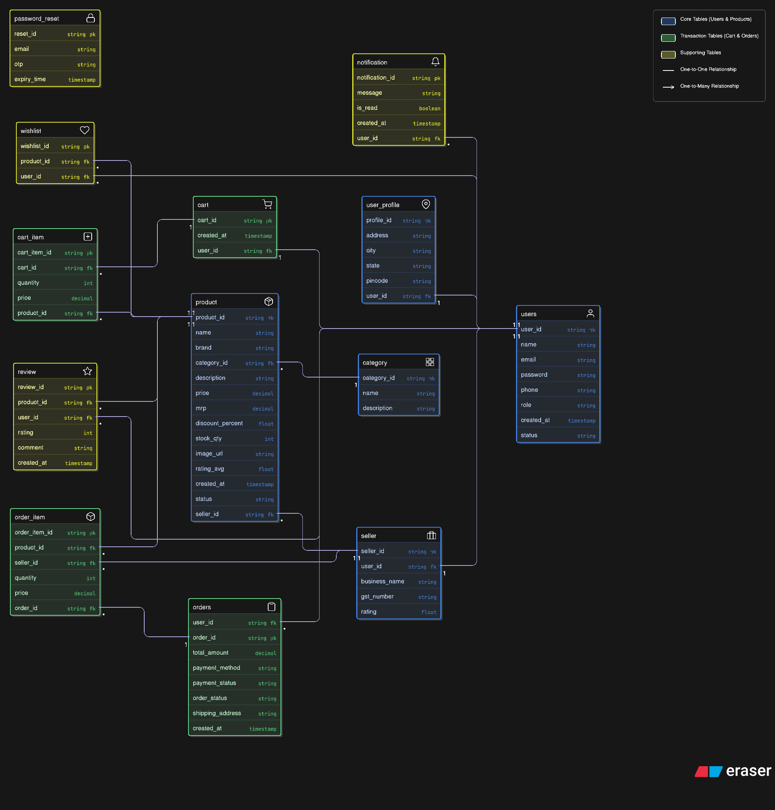

# RevShop - Monolithic E-Commerce Web Application

RevShop is a full-stack monolithic e-commerce application built with Spring Boot, Thymeleaf, and Oracle Database.
It supports buyer and seller workflows including authentication, catalog management, cart, checkout, orders, reviews, wishlist, notifications, and profile management.

## Tech Stack

- Java 21
- Spring Boot 4
- Spring Security (JWT)
- Spring Data JPA / Hibernate
- Thymeleaf + Bootstrap 5
- Oracle Database
- Maven
- JUnit 5 / Spring Boot Test

## Architecture

Layered architecture:

- Controller layer: API and MVC page endpoints
- Service layer: business rules, validations, authorization checks
- DAO layer: persistence using JPA EntityManager
- Database layer: Oracle relational schema

## Features

### Authentication and Security

- Buyer and seller registration
- Login with JWT token
- BCrypt password hashing
- Role-aware access for buyer/seller pages
- Global exception handling with standard API response envelope

### Buyer

- Browse and search products
- Filter and pagination
- Cart management
- Checkout and order history
- Return/exchange/cancel order flows
- Wishlist
- Notifications
- Profile update and profile image upload

### Seller

- Seller dashboard KPIs
- Product CRUD and product image upload
- Category CRUD and category tree
- Seller order processing lifecycle
- Notifications
- Profile update and profile image upload

## Database and ERD

- Updated ER diagram:



- ER diagram file path: `docs/RevShop_ER_Diagram.png`
- JPA entities are in `src/main/java/com/revshop/entity`

## Prerequisites

- JDK 21+
- Maven 3.9+ (or use included wrapper)
- Oracle Database (example used in this project: XE / PDB)

## Configuration

Edit `src/main/resources/application.properties` or set environment variables:

- `spring.datasource.url`
- `spring.datasource.username`
- `spring.datasource.password`
- `JWT_SECRET` (at least 32 bytes; plain text or base64)
- `JWT_EXPIRATION_MS` (optional, default `86400000`)
- `APP_ADMIN_API_KEY`

Example (PowerShell):

```powershell
$env:JWT_SECRET="RevShopJwtSecretChangeThisToAtLeast32Chars"
$env:APP_ADMIN_API_KEY="your-admin-key"
```

## Run the Application

```powershell
.\mvnw.cmd spring-boot:run
```

Application URL: `http://localhost:8080`

## API Documentation

Swagger UI:

- `http://localhost:8080/swagger-ui.html`

## Run Tests

```powershell
.\mvnw.cmd test
```

## Project Structure

```text
src/main/java/com/revshop
  controller/
  service/
  service/impl/
  dao/
  dao/impl/
  entity/
  dto/
  security/
  exception/
  config/

src/main/resources
  templates/
  static/
  application.properties
```
